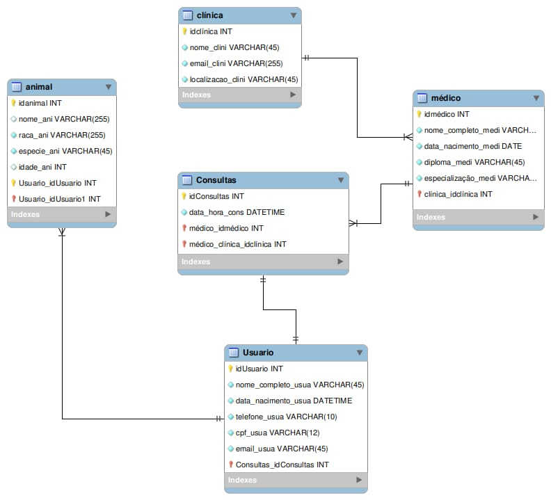

# Vet Go 🐾 

O VetGo é uma plataforma digital criada para facilitar o acesso a serviços veterinários, conectando tutores de animais a clínicas e profissionais especializados de forma rápida e eficiente. Através de um sistema inteligente de cadastro e filtragem, o usuário poderá encontrar médicos veterinários conforme o porte e tipo do animal, além da localização.

  
Professor: [Marco André Mendes](github.com/marcoandre)

## Equipe:

<table>
  <tr>
    <td align="center">
       
      <b>Gabrieli Rocha</b>
    </td>
    <td align="center">
       
      <b> Rafael Bittencourt</b>
    </td>
  </tr>
</table>

# Links do projeto:

-   Backend: [VetGo-Backend](https://github.com/VetGoDev7/VetGo-Backend.git) 
-   Frontend: [VetGo-Frontend](https://github.com/VetGoDev7/VetGo-Frontend.git) 
-   Figma: [VetGO-Figma]()
-   Docs: [VetGo-Docs](https://github.com/VetGoDev7/.github.git)

# 1. Desenvolvimento

 **Ordem de Serviço (O.S.)**

O sistema escolhido pela equipe será voltado para a área da medicina veterinária. A proposta é criar uma plataforma digital que conecte tutores de animais a clínicas e médicos veterinários, facilitando o processo de busca por atendimento especializado. O sistema permitirá o cadastro de médicos com informações como especialização (em animais de porte grande ou pequeno), localização e telefone de contato, além do cadastro de clientes com as características dos seus animais. A partir disso, os tutores poderão visualizar clínicas compatíveis com o perfil de seus pets e a região em que se encontram. 

# 2. Situação Problema

- A VetGo é um sistema que busca atuar no ramo da medicina veterinária, oferecendo uma solução digital para conectar tutores de animais a clínicas e médicos veterinários de forma prática e eficiente. A ideia partiu através de uma observação da equipe na dificuldade comum no cotidiano de tutores: encontrar profissionais disponíveis e especializados conforme a necessidade de cada animal.

- Atualmente, os tutores que precisam de atendimento veterinário enfrentam dificuldades para encontrar profissionais especializados conforme o tipo de animal e a localização. A busca é feita, em sua maioria, por redes sociais ou indicações, o que torna o processo demorado e pouco eficiente. Por outro lado, muitos veterinários autônomos ou pequenas clínicas ainda não possuem um sistema digital para divulgar seus serviços, o que limita sua visibilidade.

- Com base nessa análise, percebe-se a ausência de uma plataforma centralizada e especializada que conecte tutores aos médicos veterinários de maneira inteligente, filtrando por especialização e localização. Um software como o VetGo poderia suprir essa lacuna no mercado ao organizar as informações de forma eficiente, aproximar clientes e profissionais, e facilitar o acesso a atendimentos qualificados. A implementação dessa solução tem potencial de beneficiar ambos os lados: tutores encontrariam profissionais adequados com mais facilidade, e clínicas ganhariam visibilidade e agilidade no atendimento.

# 3. Descrição da Proposta 

Alguns pontos importantes a se destacar são:

- Permitir que os médicos veterinários se cadastrem na plataforma informando suas especializações (em animais de pequeno ou grande porte), a localização de seus consultórios e formas de contato.

- Permitir que os clientes (tutores) registrem seus animais com suas características principais, como porte e espécie, e visualizem médicos disponíveis compatíveis com o perfil do animal e a região desejada.

- Organizar as informações de forma clara e acessível, de modo que o tutor consiga encontrar rapidamente os profissionais adequados para seu animal, com base nos filtros de localização e especialização.

# 4. Regras de negócio

- **RN01 - Cadastro de Veterinários:** Apenas médicos veterinários cadastrados podem aparecer como resultados nas buscas feitas por clientes (tutores).

- **RN02 - Informação de especialização:** Cada médico veterinário deve obrigatoriamente informar sua especialização (animais de porte grande, pequeno ou ambos) e sua localização no momento do cadastro.        

- **RN03 - Cadastro de animais:** Um tutor pode cadastrar múltiplos animais em sua conta, desde que cada pet tenha seus próprios dados preenchidos.

- **RN04 - Especificação do cadastro de animais:** Um animal só poderá ser associado a um tutor por vez.

- **RN05 - Retorno vazio na busca por profissionais:** Quando não houver profissionais compatíveis com o tipo de animal e a localização selecionados, o sistema deverá informar claramente ao usuário que não há resultados disponíveis no momento.
  
- **RN06 - Atualização de dados pelos veterinários:** Veterinários devem ser responsáveis por manter atualizados os dados de localização e especialização. Dados desatualizados podem impedir a exibição nos resultados.

- **RN007 - Login de usuário:** Cada usuário (tutor ou veterinário) deve possuir um login único baseado em e-mail para acesso ao sistema.

- **RN008 - Restrição de idade:** O tutor deve ser maior de idade.

# Requisitos Funcionais:

- **RF001** - O sistema deve manter cadastro do usuário.
- **RF002** -  O sistema deve permitir o cadastro de médicos com informações como especialização.
- **RF003** - O sistema deve permitir login de usuário.
- **RF004** - O sistema deve permitir login de clínicas.
- **RF005** - O sistema deve permitir a localização das clínicas.
- **RF006** -O sistema deve exibir o contato dos veterinários disponíveis após a filtragem feita pelo cliente.
- **RF007** -O sistema deve permitir as características dos animais do usuário.
- **RF008** - O sistema deve permitir que o veterinário edite suas informações de perfil.
- **RF009:** - O sistema deve organizar as  informações de forma acessível para o tutor consiga encontrar rapidamente os profissionais adequados para seu animal

# Modelagem de Dados

  
